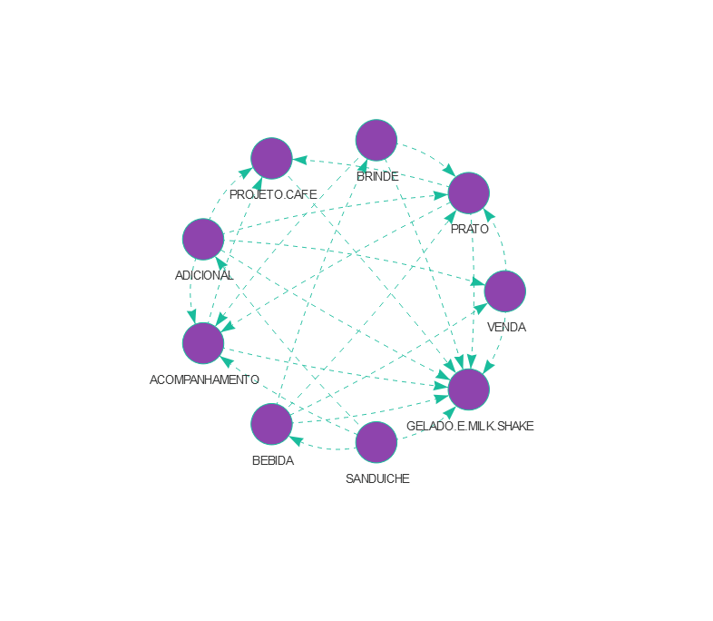
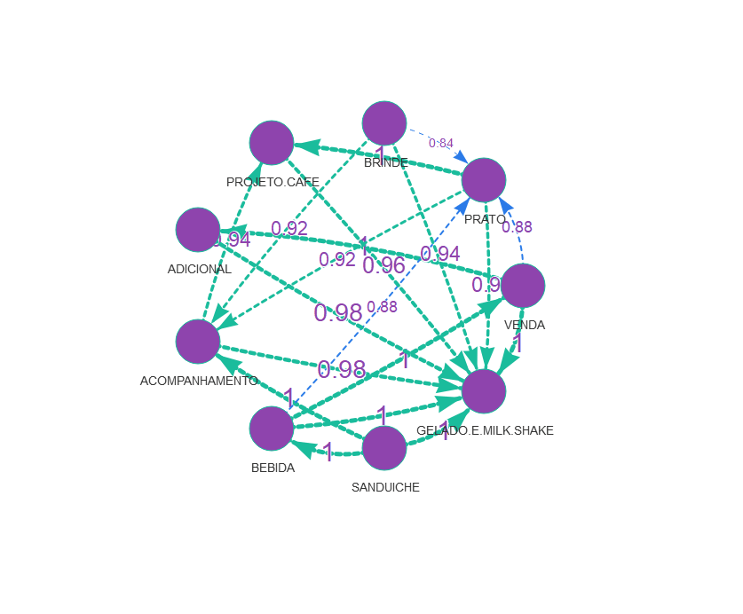
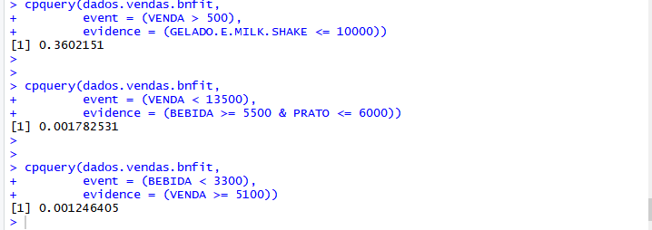
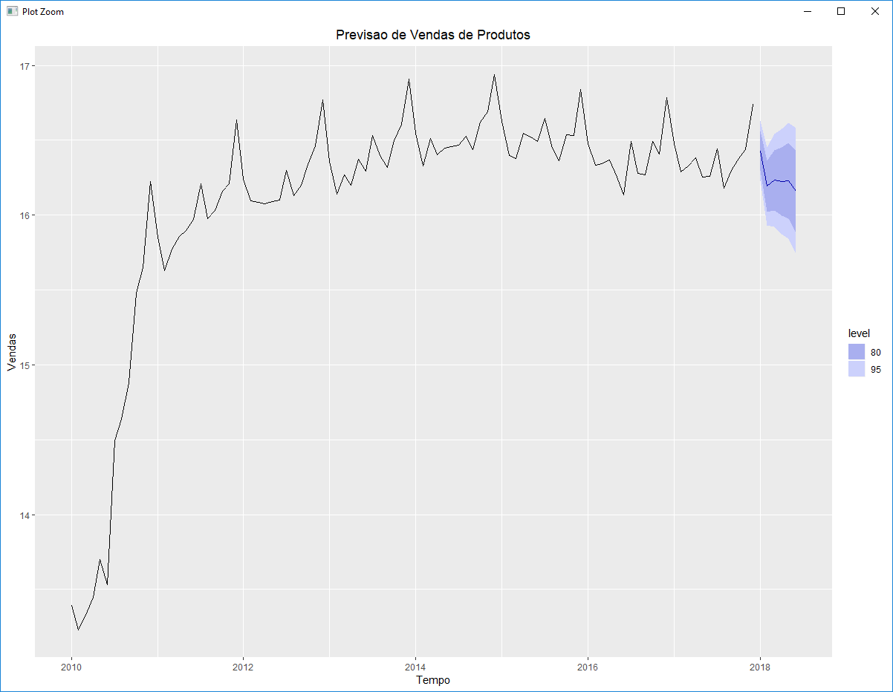

<p align="center">
 <b style='font-size:40px;'>Trabalho Semestral - Ciência da Computação Interdisciplinar</b>
</p>

<p align="center">
 <b style='font-size:40px;'>DESENVOLVIMENTO DE UMA REDE BAYESIANA COM OBJETIVO DE PREDIÇÃO UTILIZANDO O TESTE DE BOOSTING</b>
</p>

<h2>1° - Hill Climbing</h2>



A partir da imagem acima é possível interpretar que praticamente toda venda possui um milk-shake em sua composição. Também é nítido que todos os nós possuem uma ligação forte com o nó do milk-shake, o que indica que independente do cliente comprar um sanduiche, um brinde ou um prato, é fortemente apontado que seu acompanhamento será um milk-shake.
Está imagem também pode indicar que o milk-shake é o ponto mais forte do restaurante de fast food, superando seu sanduíche, brinde e prato.

Realizar a plotagem da rede Bayesiana com base em meta aprendizado com gerações de redes por meio do algoritmo Hill Climbing com suas respectivas forças associadas a cada nó. Descrever quais nós são os mais influentes e menos influentes bem como interpretar com suas palavras uma conclusão sobre tais relações.

<b style="font-size: 40px;">Código Utilizado Para Plotar Informações</b>

``` r
viewer(dados.vendas.hc,
       bayesianNetwork.width = "100%",
       bayesianNetwork.height = "80%",
       bayesianNetwork.layout = "layout_in_circle",
       bayesianNetwork.title = "Rede Bayesiana Discreta - Food-SP",
       bayesianNetwork.subtitle = "Vendas",
       edges.dashes = TRUE,
       node.colors = list(background = "#8e44ad", border = "#1abc9c",
                          highlight = list(background = "#3498db",
                                           border = "#2b7ce9"))
)
```


<h2>2° - Bayesian Networking</h2>



Com relação a imagem acima é possível compreender que o sanduíche possui uma ligação forte com a bebida e com o acompanhamento, o que indica a grande frequência de pedido acompanhados de bebidas e algum tipo de acompanhamento, além disso todos os nós possuem ligação forte com o nó do milk-shake, que indica a grande frequência de pedidos envolvendo um milk-shake em sua composição.

<b style="font-size: 40px;">Código Utilizado Para Plotar Informações</b>

``` r
strength.viewer(
  data.transform.boot,
  bayesianNetwork.arc.strength.threshold.min = 0.8,
  bayesianNetwork.arc.strength.threshold.expression.color = "@threshold >= 0.90 & @threshold <= 1",
  bayesianNetwork.arc.strength.threshold.color = "#1abc9c",
  bayesianNetwork.arc.strength.label = TRUE,
  bayesianNetwork.arc.strength.label.prefix = "",
  bayesianNetwork.arc.strength.label.color = "#8e44ad",
  bayesianNetwork.arc.strength.tooltip = TRUE,
  bayesianNetwork.width = "100%",
  bayesianNetwork.height = "80vh",
  bayesianNetwork.layout = "layout_in_circle",
  bayesianNetwork.title="Teste de Boosting",
  bayesianNetwork.subtitle = "Testes com Fast Food",
  edges.dashes = TRUE,
  node.colors = list(background = "#8e44ad", border = "#1abc9c",
                     highlight = list(background = "#3498db",
                                      border = "#2b7ce9"))
)
```


<h2>3° - cpQuery (META Aprendizado)</h2>



Para cada evento dado, é calculado a probabilidade de ocorrer um certo resultado. Então, podemos concluir que, dado o evento das vendas serem maiores que 500, calcula-se qual a chance de o milk-shake ser menor ou igual a 10.000, resultando em 36%.

Na segunda situação, dado o evento das vendas serem menores que 13.500, a probabilidade da bebida e do prato serem menores ou igual a 6.000 é calculada em 0.001%. 

Na terceira situação, dado que bebidas são menores que 3.300, a chance de as vendas serem iguais ou maiores que 5.100 é de 0.001% também.

<b style="font-size: 40px;">Resultado Obtido ao Executar os comandos</b>

``` r
> cpquery(dados.vendas.bnfit,
+         event = (VENDA > 500),
+         evidence = (GELADO.E.MILK.SHAKE <= 10000))
[1] 0.3809524
> 
> 
> cpquery(dados.vendas.bnfit,
+         event = (VENDA < 13500),
+         evidence = (BEBIDA >= 5500 & PRATO <= 6000))
[1] 0.005366726
> 
> 
> cpquery(dados.vendas.bnfit,
+         event = (BEBIDA < 3300),
+         evidence = (VENDA >= 5100))
[1] 0.001244376
```


<h2>4° - Grafico de Previsão de Vendas</h2>



Analisando o gráfico acima, é possível identificar uma sazonalidade com relação às vendas. 

Nos primeiros 6 meses do ano, existe uma queda nas vendas com certa irregularidade, mas perto do fim do ano há uma alta nas vendas que perdura até o começo de dezembro, só então é que as vendas têm uma queda, recomeçando o ciclo e isso é perceptível nos últimos 5 anos.

Após a análise dos dados e baseando-se na sazonalidade identificada, foi possível realizar uma previsão de que haverá uma queda nas vendas.	


<b style="font-size: 40px;">Código Utilizado Para Plotar Informações</b>

``` r
titleForecast <- stri_encode("Previsao de Vendas de Produtos", "", "UTF-8")
autoplot(forecast(fitTBats, 6), main = titleForecast, xlab="Tempo", ylab="Vendas")
```


<h3>References</h3>

<p>Documentação Oficial do BnViewer<a href="https://github.com/robson-fernandes/bnviewer/">https://github.com/robson-fernandes/bnviewer/</a></p>